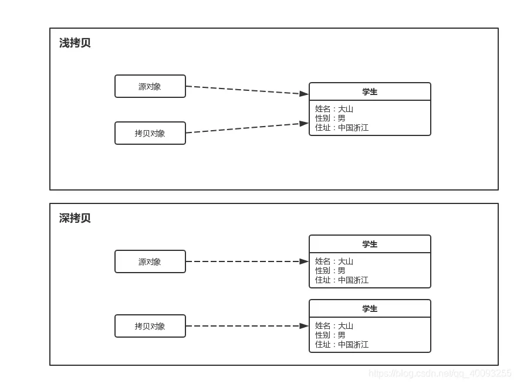
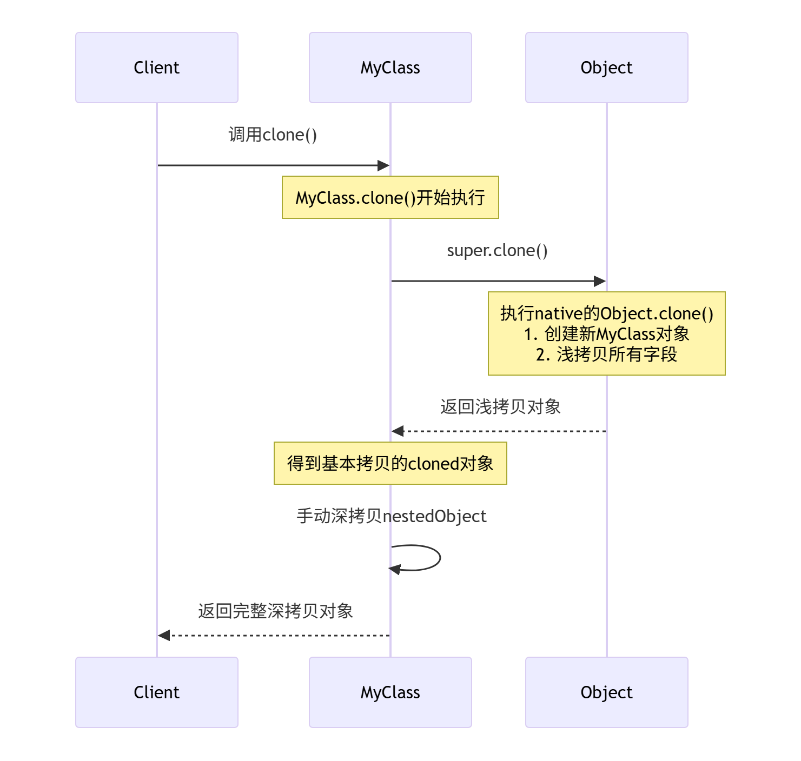
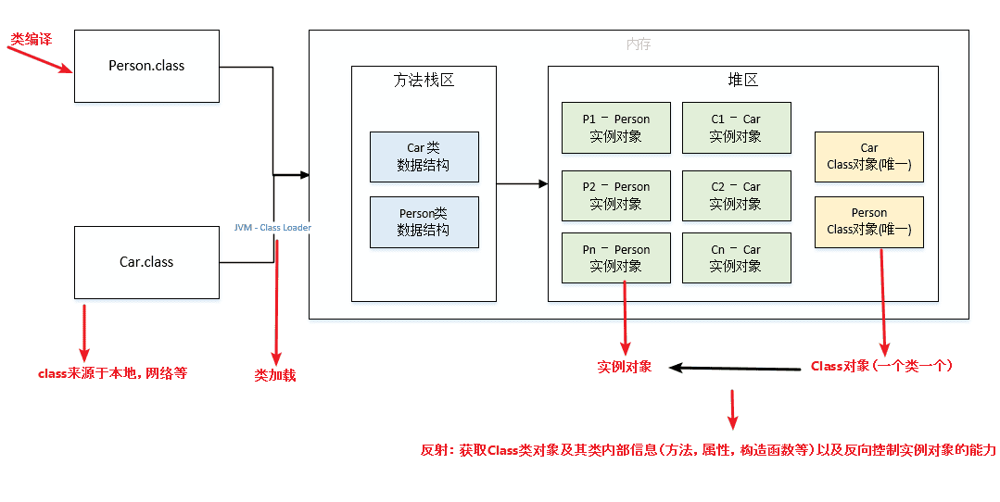
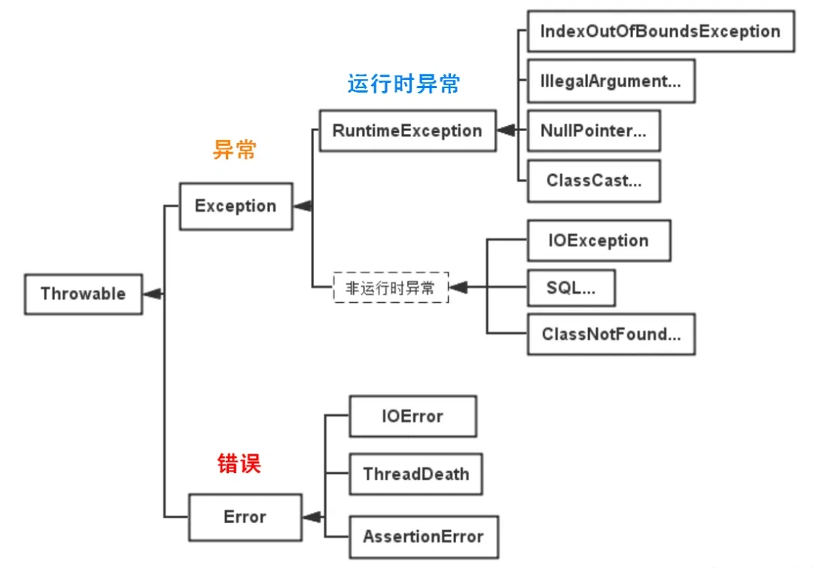
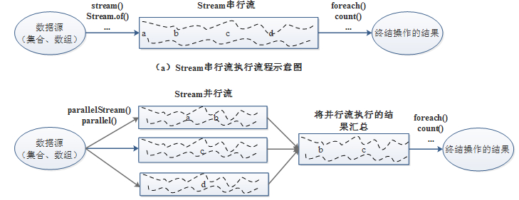
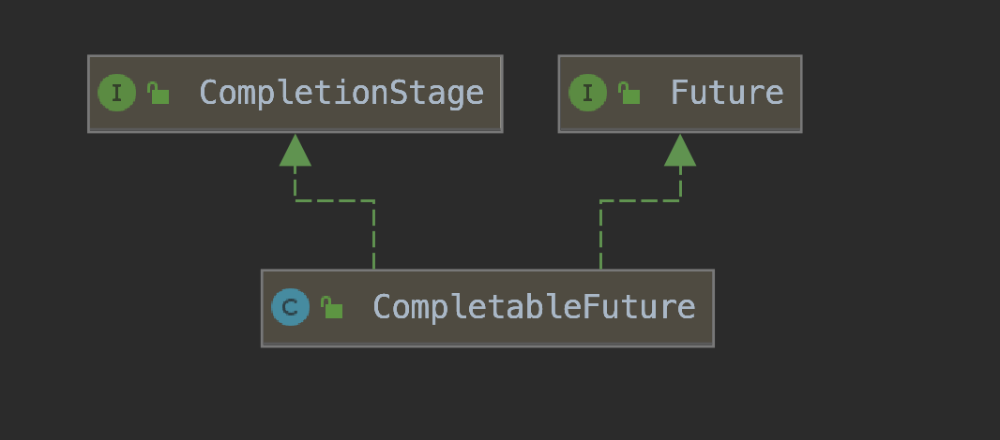

### 概念

#### Java 的优势和劣势是什么？
首先，Java的优势，我记得跨平台应该是一个大点，因为JVM的存在，一次编写到处运行。然后面向对象，这个可能也是优势，不过现在很多语言都支持面向对象，但是Java的设计从一开始就是OOP的。还有强大的生态系统，比如Spring框架，Hibernate，各种库和工具，社区支持大，企业应用广泛。另外，内存管理方面，自动垃圾回收机制，减少了内存泄漏的问题，对开发者友好。还有多线程支持，内置的线程机制，方便并发编程。安全性方面，Java有安全模型，比如沙箱机制，适合网络环境。还有稳定性，企业级应用长期使用，版本更新也比较注重向后兼容。

劣势的话，性能可能是一个，虽然JVM优化了很多，但相比C++或者Rust这种原生编译语言，还是有一定开销。特别是启动时间，比如微服务场景下，可能不如Go之类的快。语法繁琐，比如样板代码多，之前没有lambda的时候更麻烦，现在有了但比起Python还是不够简洁。内存消耗，JVM本身占内存，对于资源有限的环境可能不太友好。还有面向对象过于严格，有时候写简单程序反而麻烦，虽然Java8引入了函数式编程，但不如其他语言自然。还有开发效率，相比动态语言如Python，Java需要更多代码，编译过程也可能拖慢开发节奏。

#### jdk,jre,jvm


- JVM是Java虚拟机，是Java程序运行的环境。它负责将Java字节码（由Java编译器生成）解释或编译成机器码，并执行程序。JVM提供了内存管理、垃圾回收、安全性等功能，使得Java程序具备跨平台性。
- JDK是Java开发工具包，是开发Java程序所需的工具集合。它包含了JVM、编译器（javac）、调试器（jdb）等开发工具，以及一系列的类库（如Java标准库和开发工具库）。JDK提供了开发、编译、调试和运行Java程序所需的全部工具和环境。
- JRE是Java运行时环境，是Java程序运行所需的最小环境。它包含了JVM和一组Java类库，用于支持Java程序的执行。JRE不包含开发工具，只提供Java程序运行所需的运行环境。

#### 编译型语言和解释型语言的区别？
编译型语言：在程序执行之前，整个源代码会被编译成机器码或者字节码，生成可执行文件。执行时直接运行编译后的代码，速度快，但跨平台性较差。

解释型语言：在程序执行时，逐行解释执行源代码，不生成独立的可执行文件。通常由解释器动态解释并执行代码，跨平台性好，但执行速度相对较慢。

典型的编译型语言如C、C++，典型的解释型语言如Python、JavaScript。

### 数据类型

#### 八种基本的数据类型

Java支持数据类型分为两类： 基本数据类型和引用数据类型。

基本数据类型共有8种，可以分为三类：

- 数值型：整数类型（byte、short、int、long）和浮点类型（float、double）
- 字符型：char
- 布尔型：boolean


> Java八种基本数据类型的字节数：1字节(byte、boolean)、 2字节(short、char)、4字节(int、float)、8字节(long、double)
> 浮点数的默认类型为double（如果需要声明一个常量为float型，则必须要在末尾加上f或F）
> 整数的默认类型为int（声明Long型在末尾加上l或者L）
> 八种基本数据类型的包装类：除了char的是Character、int类型的是Integer，其他都是首字母大写
> char类型是无符号的，不能为负，所以是0开始的

#### 数据类型转换方式你知道哪些？

- 自动类型转换（隐式转换）：当目标类型的范围大于源类型时，Java会自动将源类型转换为目标类型，不需要显式的类型转换。例如，将int转换为long、将float转换为double等。
- 强制类型转换（显式转换）：当目标类型的范围小于源类型时，需要使用强制类型转换将源类型转换为目标类型。这可能导致数据丢失或溢出。例如，将long转换为int、将double转换为int等。语法为：目标类型 变量名 = (目标类型) 源类型。
- 字符串转换：Java提供了将字符串表示的数据转换为其他类型数据的方法。例如，将字符串转换为整型int，可以使用Integer.parseInt()方法；将字符串转换为浮点型double，可以使用Double.parseDouble()方法等。
- 数值之间的转换：Java提供了一些数值类型之间的转换方法，如将整型转换为字符型、将字符型转换为整型等。这些转换方式可以通过类型的包装类来实现，例如Character类、Integer类等提供了相应的转换方法。

#### 类型互转会出现什么问题吗？


#### 为什么用bigDecimal 不用double ？

double会出现精度丢失的问题，double执行的是二进制浮点运算，二进制有些情况下不能准确的表示一个小数，就像十进制不能准确的表示1/3(1/3=0.3333...)，也就是说二进制表示小数的时候只能够表示能够用1/(2^n) 的和的任意组合，但是0.1不能够精确表示，因为它不能够表示成为1/(2^n)的和的形式。

```java
System.out.println(0.05 + 0.01);
System.out.println(1.0 - 0.42);
System.out.println(4.015 * 100);
System.out.println(123.3 / 100);

输出：
0.060000000000000005
0.5800000000000001
401.49999999999994
1.2329999999999999
```

可以看到在Java中进行浮点数运算的时候，会出现丢失精度的问题。那么我们如果在进行商品价格计算的时候，就会出现问题。很有可能造成我们手中有0.06元，却无法购买一个0.05元和一个0.01元的商品。因为如上所示，他们两个的总和为0.060000000000000005。这无疑是一个很严重的问题，尤其是当电商网站的并发量上去的时候，出现的问题将是巨大的。可能会导致无法下单，或者对账出现问题。

而 Decimal 是精确计算 , 所以一般牵扯到金钱的计算 , 都使用 Decimal。

```java
import java.math.BigDecimal;

public class BigDecimalExample {
    public static void main(String[] args) {
        BigDecimal num1 = new BigDecimal("0.1");
        BigDecimal num2 = new BigDecimal("0.2");

        BigDecimal sum = num1.add(num2);
        BigDecimal product = num1.multiply(num2);

        System.out.println("Sum: " + sum);
        System.out.println("Product: " + product);
    }
}

//输出
Sum: 0.3
Product: 0.02
```

这样的使用BigDecimal可以确保精确的十进制数值计算，避免了使用double可能出现的舍入误差。需要注意的是，在创建BigDecimal对象时，应该使用字符串作为参数，而不是直接使用浮点数值，以避免浮点数精度丢失。

### 面向对象

#### Java抽象类和接口的区别是什么？
两者的特点：

- 抽象类用于描述类的共同特性和行为，可以有成员变量、构造方法和具体方法。适用于有明显继承关系的场景。
- 接口用于定义行为规范，可以多实现，只能有常量和抽象方法（Java 8 以后可以有默认方法和静态方法）。适用于定义类的能力或功能。

两者的区别：

- 实现方式：实现接口的关键字为implements，继承抽象类的关键字为extends。一个类可以实现多个接口，但一个类只能继承一个抽象类。所以，使用接口可以间接地实现多重继承。
- 方法方式：接口只有定义，不能有方法的实现，java 1.8中可以定义default方法体，而抽象类可以有定义与实现，方法可在抽象类中实现。
- 访问修饰符：接口成员变量默认为public static final，必须赋初值，不能被修改；其所有的成员方法都是public、abstract的。抽象类中成员变量默认default，可在子类中被重新定义，也可被重新赋值；抽象方法被abstract修饰，不能被private、static、synchronized和native等修饰，必须以分号结尾，不带花括号。
- 变量：抽象类可以包含实例变量和静态变量，而接口只能包含常量（即静态常量）。

**抽象类能加final修饰吗**
不能，Java中的抽象类是用来被继承的，而final修饰符用于禁止类被继承或方法被重写，因此，抽象类和final修饰符是互斥的，不能同时使用。

#### 重载与重写有什么区别？
重载（Overloading）指的是在同一个类中，可以有多个同名方法，它们具有不同的参数列表（参数类型、参数个数或参数顺序不同），编译器根据调用时的参数类型来决定调用哪个方法。
重写（Overriding）指的是子类可以重新定义父类中的方法，方法名、参数列表和返回类型必须与父类中的方法一致，通过@override注解来明确表示这是对父类方法的重写。
重载是指在同一个类中定义多个同名方法，而重写是指子类重新定义父类中的方法。

#### 接口里面可以定义哪些方法？


#### 抽象类可以被实例化吗？

在Java中，抽象类本身不能被实例化。

这意味着不能使用new关键字直接创建一个抽象类的对象。抽象类的存在主要是为了被继承，它通常包含一个或多个抽象方法（由abstract关键字修饰且无方法体的方法），这些方法需要在子类中被实现。

抽象类可以有构造器，这些构造器在子类实例化时会被调用，以便进行必要的初始化工作。然而，这个过程并不是直接实例化抽象类，而是创建了子类的实例，间接地使用了抽象类的构造器。

```java
public abstract class AbstractClass {
    public AbstractClass() {
        // 构造器代码
    }
    
    public abstract void abstractMethod();
}

public class ConcreteClass extends AbstractClass {
    public ConcreteClass() {
        super(); // 调用抽象类的构造器
    }
    
    @Override
    public void abstractMethod() {
        // 实现抽象方法
    }
}

// 下面的代码可以运行
ConcreteClass obj = new ConcreteClass();
```

简而言之，抽象类不能直接实例化，但通过继承抽象类并实现所有抽象方法的子类是可以被实例化的。

#### 解释Java中的静态变量和静态方法

在Java中，静态变量和静态方法是与类本身关联的，而不是与类的实例（对象）关联。它们在内存中只存在一份，可以被类的所有实例共享。

**静态变量**（也称为类变量）是在类中使用static关键字声明的变量。它们属于类而不是任何具体的对象。主要的特点：

- 共享性：所有该类的实例共享同一个静态变量。如果一个实例修改了静态变量的值，其他实例也会看到这个更改。
- 初始化：静态变量在类被加载时初始化，只会对其进行一次分配内存。
- 访问方式：静态变量可以直接通过类名访问，也可以通过实例访问，但推荐使用类名。

```java
public class MyClass {
    static int staticVar = 0; // 静态变量

    public MyClass() {
        staticVar++; // 每创建一个对象，静态变量自增
    }
    
    public static void printStaticVar() {
        System.out.println("Static Var: " + staticVar);
    }
}

// 使用示例
MyClass obj1 = new MyClass();
MyClass obj2 = new MyClass();
MyClass.printStaticVar(); // 输出 Static Var: 2
```

**静态方法**是在类中使用static关键字声明的方法。类似于静态变量，静态方法也属于类，而不是任何具体的对象。主要的特点：

- 无实例依赖：静态方法可以在没有创建类实例的情况下调用。对于静态方法来说，不能直接访问非静态的成员变量或方法，因为静态方法没有上下文的实例。
- 访问静态成员：静态方法可以直接调用其他静态变量和静态方法，但不能直接访问非静态成员。
- 多态性：静态方法不支持重写（Override），但可以被隐藏（Hide）。

```java
public class MyClass {
    static int count = 0;

    // 静态方法
    public static void incrementCount() {
        count++;
    }

    public static void displayCount() {
        System.out.println("Count: " + count);
    }
}

// 使用示例
MyClass.incrementCount(); // 调用静态方法
MyClass.displayCount();   // 输出 Count: 1
```

静态变量：常用于需要在所有对象间共享的数据，如计数器、常量等。
静态方法：常用于助手方法（utility methods）、获取类级别的信息或者是没有依赖于实例的数据处理。

#### 非静态内部类和静态内部类的区别？

 区别包括：  

- 非静态内部类依赖于外部类的实例，而静态内部类不依赖于外部类的实例。 
- 非静态内部类可以访问外部类的实例变量和方法，而静态内部类只能访问外部类的静态成员。 非静态内部类不能定义静态成员，而静态内部类可以定义静态成员。 
- 非静态内部类在外部类实例化后才能实例化，而静态内部类可以独立实例化。
-  非静态内部类可以访问外部类的私有成员，而静态内部类不能直接访问外部类的私有成员，需要通过实例化外部类来访问。

**非静态内部类可以直接访问外部方法，编译器是怎么做到的？**

非静态内部类可以直接访问外部方法是因为编译器在生成字节码时会为非静态内部类维护一个指向外部类实例的引用。

这个引用使得非静态内部类能够访问外部类的实例变量和方法。编译器会在生成非静态内部类的构造方法时，将外部类实例作为参数传入，并在内部类的实例化过程中建立外部类实例与内部类实例之间的联系，从而实现直接访问外部方法的功能。

### 关键字

#### final 作用是什么？

`final`关键字主要有以下三个方面的作用：用于修饰类、方法和变量。

- 修饰类：当`final`修饰一个类时，表示这个类不能被继承，是类继承体系中的最终形态。例如，Java 中的`String`类就是用`final`修饰的，这保证了`String`类的不可变性和安全性，防止其他类通过继承来改变`String`类的行为和特性。
- 修饰方法：用`final`修饰的方法不能在子类中被重写。比如，`java.lang.Object`类中的`getClass`方法就是`final`的，因为这个方法的行为是由 Java 虚拟机底层实现来保证的，不应该被子类修改。
- 修饰变量：当`final`修饰基本数据类型的变量时，该变量一旦被赋值就不能再改变。例如，`final int num = 10;`，这里的`num`就是一个常量，不能再对其进行重新赋值操作，否则会导致编译错误。对于引用数据类型，`final`修饰意味着这个引用变量不能再指向其他对象，但对象本身的内容是可以改变的。例如，`final StringBuilder sb = new StringBuilder("Hello");`，不能让`sb`再指向其他`StringBuilder`对象，但可以通过`sb.append(" World");`来修改字符串的内容。

#### static的作用是什么？

`static` 关键字主要用于修饰类的成员（变量、方法、代码块）和内部类，其核心作用是**将成员与类本身关联，而非与类的实例（对象）关联**。具体作用如下：

> 1、修饰变量

被 `static` 修饰的变量属于类本身，而非类的某个实例。所有对象共享同一份静态变量，内存中只存在一份副本。可以通过 `类名.变量名` 直接访问，无需创建对象（也可通过对象访问，但不推荐）。

通常用于存储所有对象共享的数据，如常量、计数器等。

```java
public class Student {
    // 静态变量（所有学生共享同一个学校名称）
    public static String schoolName = "阳光中学";
    // 实例变量（每个学生有自己的姓名）
    private String name;
}

// 访问静态变量
public class Test {
    public static void main(String[] args) {
        System.out.println(Student.schoolName); // 直接通过类名访问
    }
}
```

> 2、修饰方法

静态方法属于类，不属于任何实例，因此**不能直接访问类中的非静态成员（变量 / 方法）**（因为非静态成员依赖于对象存在），但可以访问静态成员。通过 `类名.方法名` 直接调用，无需创建对象。

通常用于工具类方法（如 `Math.random()`）、工厂方法等，不需要依赖对象状态即可完成操作。

```java
public class MathUtils {
    // 静态方法（无需创建对象即可调用）
    public static int add(int a, int b) {
        return a + b;
    }
}

// 调用静态方法
public class Test {
    public static void main(String[] args) {
        int result = MathUtils.add(2, 3); // 直接通过类名调用
    }
}
```

> 3、修饰代码块

静态代码块在**类加载时执行**，且只执行一次（优于对象构造方法），用于初始化静态变量或执行类级别的预处理操作。

多个静态代码块按定义顺序执行，且先于非静态代码块和构造方法。

```java
public class Database {
    private static String url;
    
    // 静态代码块：初始化静态变量
    static {
        url = "jdbc:mysql://localhost:3306/test";
        System.out.println("数据库连接地址初始化完成");
    }
}
```

> 4、修饰内部类

静态内部类不依赖于外部类的实例，可以独立存在，**不能直接访问外部类的非静态成员**（需通过外部类实例访问）。

当内部类与外部类的实例无关时使用，避免内部类持有外部类的引用导致的内存泄漏。

```java
public class OuterClass {
    private static int staticVar = 10;
    private int instanceVar = 20;
    
    // 静态内部类
    public static class StaticInnerClass {
        public void print() {
            System.out.println(staticVar); // 可访问外部类静态变量
            // System.out.println(instanceVar); // 错误：不能直接访问非静态变量
        }
    }
}

// 使用静态内部类
public class Test {
    public static void main(String[] args) {
        OuterClass.StaticInnerClass inner = new OuterClass.StaticInnerClass();
        inner.print();
    }
}
```

### 深拷贝和浅拷贝

#### 深拷贝和浅拷贝的区别？



- 浅拷贝是指只复制对象本身和其内部的值类型字段，但不会复制对象内部的引用类型字段。换句话说，浅拷贝只是创建一个新的对象，然后将原对象的字段值复制到新对象中，但如果原对象内部有引用类型的字段，只是将引用复制到新对象中，两个对象指向的是同一个引用对象。
- 深拷贝是指在复制对象的同时，将对象内部的所有引用类型字段的内容也复制一份，而不是共享引用。换句话说，深拷贝会递归复制对象内部所有引用类型的字段，生成一个全新的对象以及其内部的所有对象。

#### 实现深拷贝的三种方法是什么？

在 Java 中，实现对象深拷贝的方法有以下几种主要方式：

> 实现 Cloneable 接口并重写 clone() 方法

这种方法要求对象及其所有引用类型字段都实现 Cloneable 接口，并且重写 clone() 方法。在 clone() 方法中，通过递归克隆引用类型字段来实现深拷贝。



```java
class MyClass implements Cloneable {
    private String field1;
    private NestedClass nestedObject;

    @Override
    protected Object clone() throws CloneNotSupportedException {
        // 第一步：调用Object.clone()进行浅拷贝
        // 创建一个新的MyClass对象，复制field1和nestedObject的引用
        MyClass cloned = (MyClass) super.clone();
        
        // 第二步：手动深拷贝引用对象
        // 如果不做这步，cloned.nestedObject和原对象的nestedObject指向同一个对象
        cloned.nestedObject = (NestedClass) nestedObject.clone(); 
        return cloned;
    }
}

class NestedClass implements Cloneable {
    private int nestedField;

    @Override
    protected Object clone() throws CloneNotSupportedException {
        return super.clone();
    }
}
```

> 使用序列化和反序列化

通过将对象序列化为字节流，再从字节流反序列化为对象来实现深拷贝。要求对象及其所有引用类型字段都实现 Serializable 接口。

```java
import java.io.*;

class MyClass implements Serializable {
    private String field1;
    private NestedClass nestedObject;

    public MyClass deepCopy() {
        try {
            ByteArrayOutputStream bos = new ByteArrayOutputStream();
            ObjectOutputStream oos = new ObjectOutputStream(bos);
            oos.writeObject(this);
            oos.flush();
            oos.close();

            ByteArrayInputStream bis = new ByteArrayInputStream(bos.toByteArray());
            ObjectInputStream ois = new ObjectInputStream(bis);
            return (MyClass) ois.readObject();
        } catch (IOException | ClassNotFoundException e) {
            e.printStackTrace();
            return null;
        }
    }
}

class NestedClass implements Serializable {
    private int nestedField;
}
```

> 手动递归复制

针对特定对象结构，手动递归复制对象及其引用类型字段。适用于对象结构复杂度不高的情况。

```java
class MyClass {
    private String field1;
    private NestedClass nestedObject;

    public MyClass deepCopy() {
        MyClass copy = new MyClass();
        copy.setField1(this.field1);
        copy.setNestedObject(this.nestedObject.deepCopy());
        return copy;
    }
}

class NestedClass {
    private int nestedField;

    public NestedClass deepCopy() {
        NestedClass copy = new NestedClass();
        copy.setNestedField(this.nestedField);
        return copy;
    }
}
```

### 泛型

泛型是 Java 编程语言中的一个重要特性，它允许类、接口和方法在定义时使用一个或多个类型参数，这些类型参数在使用时可以被指定为具体的类型。

泛型的主要目的是在编译时提供更强的类型检查，并且在编译后能够保留类型信息，避免了在运行时出现类型转换异常。

> 为什么需要泛型？

- **适用于多种数据类型执行相同的代码**

```java
private static int add(int a, int b) {
    System.out.println(a + "+" + b + "=" + (a + b));
    return a + b;
}

private static float add(float a, float b) {
    System.out.println(a + "+" + b + "=" + (a + b));
    return a + b;
}

private static double add(double a, double b) {
    System.out.println(a + "+" + b + "=" + (a + b));
    return a + b;
}
```

如果没有泛型，要实现不同类型的加法，每种类型都需要重载一个add方法；通过泛型，我们可以复用为一个方法：

```java
private static <T extends Number> double add(T a, T b) {
    System.out.println(a + "+" + b + "=" + (a.doubleValue() + b.doubleValue()));
    return a.doubleValue() + b.doubleValue();
}
```

- **泛型中的类型在使用时指定，不需要强制类型转换**（**类型安全**，编译器会**检查类型**）

看下这个例子：

```java
List list = new ArrayList();
list.add("xxString");
list.add(100d);
list.add(new Person());
```

我们在使用上述list中，list中的元素都是Object类型（无法约束其中的类型），所以在取出集合元素时需要人为的强制类型转化到具体的目标类型，且很容易出现java.lang.ClassCastException异常。

引入泛型，它将提供类型的约束，提供编译前的检查：

```java
List<String> list = new ArrayList<String>();

// list中只能放String, 不能放其它类型的元素
```

### 对象

#### java创建对象有哪些方式？

在Java中，创建对象的方式有多种，常见的包括：

**1、使用new关键字**：这是最常见、最基础的创建对象方式。通过调用类的构造器来实例化对象。

```java
// 定义一个类
public class Person {
    private String name;
    
    public Person() {} // 默认构造器
    public Person(String name) { // 带参构造器
        this.name = name;
    }
    
    public void sayHello() {
        System.out.println("Hello, " + name);
    }
}

// 使用 new 创建对象
public class Main {
    public static void main(String[] args) {
        Person person1 = new Person(); // 调用无参构造
        Person person2 = new Person("Alice"); // 调用有参构造
        
        person2.sayHello(); // 输出: Hello, Alice
    }
}
```

优点是简单、直接、明确。缺点是紧密耦合，必须知道具体的类名。

**2、使用Class类的newInstance()方法**：通过 Java 的反射 API，在运行时动态地创建对象。这种方式不需要在编译时知道具体的类。

> 注意：Class.newInstance() 在 JDK 9 后被标记为过时，因为它只能调用无参公有构造器，且会抛出所有异常。`Constructor.newInstance()` 更强大、更灵活。
>
> `MyClass obj = (MyClass) Class.forName("com.example.MyClass").newInstance();`

应用场景：框架设计（如 Spring 的 IOC 容器）、动态代理等。

**注意**：`Class.newInstance()` 在 JDK 9 后被标记为过时，因为它只能调用无参公有构造器，且会抛出所有异常。`Constructor.newInstance()` 更强大、更灵活。

**使用Constructor类的newInstance()方法**：同样是通过反射机制，可以使用Constructor类的newInstance()方法创建对象。

```java
Constructor<MyClass> constructor = MyClass.class.getConstructor();
MyClass obj = constructor.newInstance();
```

**3、使用clone()方法**：通过实现 `Cloneable` 接口并重写 `Object` 类的 `clone()` 方法，可以基于一个现有对象（原型）创建一个新的副本对象。

```java
// 实现 Cloneable 接口
public class Person implements Cloneable {
    private String name;
    
    // ... 构造器和其他方法 ...
    
    @Override
    protected Object clone() throws CloneNotSupportedException {
        return super.clone(); // 浅拷贝
    }
}

public class Main {
    public static void main(String[] args) {
        Person original = new Person("Charlie");
        try {
            Person copy = (Person) original.clone(); // 创建副本
            copy.sayHello(); // 输出: Hello, Charlie
        } catch (CloneNotSupportedException e) {
            e.printStackTrace();
        }
    }
}
```

`Object.clone()` 默认是浅拷贝，对于引用类型的字段，复制的是引用地址，而不是引用的对象本身。如果需要深拷贝，必须在 `clone()` 方法中手动对引用对象进行克隆。

**4、使用反序列化**：通过 `ObjectInputStream` 从一个字节流（通常是文件或网络）中重建一个对象。

```java
import java.io.*;

// 必须实现 Serializable 接口
public class Person implements Serializable {
    private String name;
    // ... 构造器和其他方法 ...
}

public class Main {
    public static void main(String[] args) {
        Person personToSave = new Person("David");
        
        // 序列化对象到文件
        try (ObjectOutputStream oos = new ObjectOutputStream(new FileOutputStream("person.dat"))) {
            oos.writeObject(personToSave);
        } catch (IOException e) {
            e.printStackTrace();
        }
        
        // 从文件反序列化对象
        try (ObjectInputStream ois = new ObjectInputStream(new FileInputStream("person.dat"))) {
            Person restoredPerson = (Person) ois.readObject(); // 创建新对象
            restoredPerson.sayHello(); // 输出: Hello, David
        } catch (IOException | ClassNotFoundException e) {
            e.printStackTrace();
        }
    }
}
```

特点是不会调用类的任何构造器，类必须实现 `java.io.Serializable` 接口。

**5、使用工厂模式**：这是一种设计模式，不直接使用 `new`，而是通过一个方法来返回对象实例。`getInstance()`、`valueOf()` 等都是常见的工厂方法。

```java
public class Person {
    private String name;
    
    private Person(String name) { // 构造器可以是私有的
        this.name = name;
    }
    
    // 静态工厂方法
    public static Person createPerson(String name) {
        // 这里可以做一些额外的逻辑，比如缓存、日志、返回子类实例等
        return new Person(name);
    }
}

public class Main {
    public static void main(String[] args) {
        // 不是用 new，而是用工厂方法创建
        Person person = Person.createPerson("Eva");
        person.sayHello();
    }
}
```

优点是将对象的创建与使用分离，降低耦合，还可以隐藏创建对象的复杂逻辑（如池化技术、缓存）。

Java 标准库中的例子：`Integer.valueOf(int)`，`Calendar.getInstance()`。

最后来个，总结对比：

| 方式             | 核心原理       | 是否调用构造器？       | 特点与应用场景                              |
| :--------------- | :------------- | :--------------------- | :------------------------------------------ |
| **`new` 关键字** | JVM 指令       | **是**                 | 最标准、最常用，紧密耦合                    |
| **反射**         | 运行时类信息   | **是** (`Constructor`) | 灵活，解耦，用于框架                        |
| **`clone()`**    | 复制现有对象   | **否**                 | 基于原型创建副本，需实现 `Cloneable`        |
| **反序列化**     | 从字节流恢复   | **否**                 | 用于持久化和网络通信，需实现 `Serializable` |
| **工厂模式**     | 方法封装 `new` | **是** (在方法内)      | 解耦，隐藏创建逻辑，控制实例                |

#### New出的对象什么时候回收？

通过过关键字`new`创建的对象，由Java的垃圾回收器（Garbage Collector）负责回收。垃圾回收器的工作是在程序运行过程中自动进行的，它会周期性地检测不再被引用的对象，并将其回收释放内存。

具体来说，Java对象的回收时机是由垃圾回收器根据一些算法来决定的，主要有以下几种情况：

1. 引用计数法：某个对象的引用计数为0时，表示该对象不再被引用，可以被回收。
2. 可达性分析算法：从根对象（如方法区中的类静态属性、方法中的局部变量等）出发，通过对象之间的引用链进行遍历，如果存在一条引用链到达某个对象，则说明该对象是可达的，反之不可达，不可达的对象将被回收。
3. 终结器（Finalizer）：如果对象重写了`finalize()`方法，垃圾回收器会在回收该对象之前调用`finalize()`方法，对象可以在`finalize()`方法中进行一些清理操作。然而，终结器机制的使用不被推荐，因为它的执行时间是不确定的，可能会导致不可预测的性能问题。

#### 如何获取私有对象？

在 Java 中，私有对象通常指的是类中被声明为 `private` 的成员变量或方法。由于 `private` 访问修饰符的限制，这些成员只能在其所在的类内部被访问。

不过，可以通过下面两种方式来间接获取私有对象。

- 使用公共访问器方法（getter 方法）：如果类的设计者遵循良好的编程规范，通常会为私有成员变量提供公共的访问器方法（即 `getter` 方法），通过调用这些方法可以安全地获取私有对象。

```java
class MyClass {
    // 私有成员变量
    private String privateField = "私有字段的值";

    // 公共的 getter 方法
    public String getPrivateField() {
        return privateField;
    }
}

public class Main {
    public static void main(String[] args) {
        MyClass obj = new MyClass();
        // 通过调用 getter 方法获取私有对象
        String value = obj.getPrivateField();
        System.out.println(value); 
    }
}
```

- 反射机制。反射机制允许在运行时检查和修改类、方法、字段等信息，通过反射可以绕过 `private` 访问修饰符的限制来获取私有对象。

```java
import java.lang.reflect.Field;

class MyClass {
    private String privateField = "私有字段的值";
}

public class Main {
    public static void main(String[] args) throws NoSuchFieldException, IllegalAccessException {
        MyClass obj = new MyClass();
        // 获取 Class 对象
        Class<?> clazz = obj.getClass();
        // 获取私有字段
        Field privateField = clazz.getDeclaredField("privateField");
        // 设置可访问性
        privateField.setAccessible(true);
        // 获取私有字段的值
        String value = (String) privateField.get(obj);
        System.out.println(value); 
    }
}
```

### 反射

#### 什么是反射？

Java 反射机制是在运行状态中，对于任意一个类，都能够知道这个类中的所有属性和方法，对于任意一个对象，都能够调用它的任意一个方法和属性；这种动态获取的信息以及动态调用对象的方法的功能称为 Java 语言的反射机制。

反射具有以下特性：

1. **运行时类信息访问**：反射机制允许程序在运行时获取类的完整结构信息，包括类名、包名、父类、实现的接口、构造函数、方法和字段等。
2. **动态对象创建**：可以使用反射API动态地创建对象实例，即使在编译时不知道具体的类名。这是通过Class类的newInstance()方法或Constructor对象的newInstance()方法实现的。
3. **动态方法调用**：可以在运行时动态地调用对象的方法，包括私有方法。这通过Method类的invoke()方法实现，允许你传入对象实例和参数值来执行方法。
4. **访问和修改字段值**：反射还允许程序在运行时访问和修改对象的字段值，即使是私有的。这是通过Field类的get()和set()方法完成的。



#### 反射的应用场景有哪些?

> 加载数据库驱动

我们的项目底层数据库有时是用mysql，有时用oracle，需要动态地根据实际情况加载驱动类，这个时候反射就有用了，假设 com.mikechen.java.myqlConnection，com.mikechen.java.oracleConnection这两个类我们要用。

这时候我们在使用 JDBC 连接数据库时使用 Class.forName()通过反射加载数据库的驱动程序，如果是mysql则传入mysql的驱动类，而如果是oracle则传入的参数就变成另一个了。

```java
//  DriverManager.registerDriver(new com.mysql.cj.jdbc.Driver());
Class.forName("com.mysql.cj.jdbc.Driver");
```

> 配置文件加载

Spring 框架的 IOC（动态加载管理 Bean），Spring通过配置文件配置各种各样的bean，你需要用到哪些bean就配哪些，spring容器就会根据你的需求去动态加载，你的程序就能健壮地运行。

Spring通过XML配置模式装载Bean的过程：

- 将程序中所有XML或properties配置文件加载入内存
- Java类里面解析xml或者properties里面的内容，得到对应实体类的字节码字符串以及相关的属性信息
- 使用反射机制，根据这个字符串获得某个类的Class实例
- 动态配置实例的属性

配置文件

```java
className=com.example.reflectdemo.TestInvoke
methodName=printlnState
```

实体类

```java
public class TestInvoke {
    private void printlnState(){
        System.out.println("I am fine");
    }
}
```

解析配置文件内容

```java
// 解析xml或properties里面的内容，得到对应实体类的字节码字符串以及属性信息
public static String getName(String key) throws IOException {
    Properties properties = new Properties();
    FileInputStream in = new FileInputStream("D:\IdeaProjects\AllDemos\language-specification\src\main\resources\application.properties");
    properties.load(in);
    in.close();
    return properties.getProperty(key);
}
```

利用反射获取实体类的Class实例，创建实体类的实例对象，调用方法

```java
public static void main(String[] args) throws NoSuchMethodException, InvocationTargetException, IllegalAccessException, IOException, ClassNotFoundException, InstantiationException {
    // 使用反射机制，根据这个字符串获得Class对象
    Class<?> c = Class.forName(getName("className"));
    System.out.println(c.getSimpleName());
    // 获取方法
    Method method = c.getDeclaredMethod(getName("methodName"));
    // 绕过安全检查
    method.setAccessible(true);
    // 创建实例对象
    TestInvoke testInvoke = (TestInvoke)c.newInstance();
    // 调用方法
    method.invoke(testInvoke);
}
```

运行结果：


### 注解

#### 能讲一讲Java注解的原理吗？

注解本质是一个继承了Annotation的特殊接口，其具体实现类是Java运行时生成的动态代理类。

我们通过反射获取注解时，返回的是Java运行时生成的动态代理对象。通过代理对象调用自定义注解的方法，会最终调用AnnotationInvocationHandler的invoke方法。该方法会从memberValues这个Map中索引出对应的值。而memberValues的来源是Java常量池。

#### 对注解解析的底层实现了解吗？

注解本质上是一种特殊的接口，它继承自 `java.lang.annotation.Annotation` 接口，**所以注解也叫声明式接口**，例如，定义一个简单的注解：

```java
public @interface MyAnnotation {
    String value();
}
```

编译后，Java 编译器会将其转换为一个继承自 `Annotation` 的接口，并生成相应的字节码文件。

根据注解的作用范围，Java 注解可以分为以下几种类型：

- **源码级别注解** ：仅存在于源码中，编译后不会保留（`@Retention(RetentionPolicy.SOURCE)`）。
- **类文件级别注解** ：保留在 `.class` 文件中，但运行时不可见（`@Retention(RetentionPolicy.CLASS)`）。
- **运行时注解** ：保留在 `.class` 文件中，并且可以通过反射在运行时访问（`@Retention(RetentionPolicy.RUNTIME)`）。

只有运行时注解可以通过反射机制进行解析。

当注解被标记为 `RUNTIME` 时，Java 编译器会在生成的 `.class` 文件中保存注解信息。这些信息存储在字节码的属性表（Attribute Table）中，具体包括以下内容：

- **RuntimeVisibleAnnotations** ：存储运行时可见的注解信息。
- **RuntimeInvisibleAnnotations** ：存储运行时不可见的注解信息。
- **RuntimeVisibleParameterAnnotations** 和 **RuntimeInvisibleParameterAnnotations** ：存储方法参数上的注解信息。

通过工具（如 `javap -v`）可以查看 `.class` 文件中的注解信息。

注解的解析主要依赖于 Java 的反射机制。以下是解析注解的基本流程：

1、获取注册信息：通过反射 API 可以获取类、方法、字段等元素上的注解。例如：

```java
Class<?> clazz = MyClass.class;
MyAnnotation annotation = clazz.getAnnotation(MyAnnotation.class);
if (annotation != null) {
    System.out.println(annotation.value());
}
```

2、底层原理：反射机制的核心类是 `java.lang.reflect.AnnotatedElement`，它是所有可以被注解修饰的元素（如 `Class`、`Method`、`Field` 等）的父接口。该接口提供了以下方法：

- `getAnnotation(Class<T> annotationClass)`：获取指定类型的注解。
- `getAnnotations()`：获取所有注解。
- `isAnnotationPresent(Class<? extends Annotation> annotationClass)`：判断是否包含指定注解。

这些方法的底层实现依赖于 JVM 提供的本地方法（Native Method），例如：

- `native Annotation[] getDeclaredAnnotations0(boolean publicOnly);`
- `native <A extends Annotation> A getAnnotation(Class<A> annotationClass);`

JVM 在加载类时会解析 `.class` 文件中的注解信息，并将其存储在内存中，供反射机制使用。

因此，注解解析的底层实现主要依赖于 Java 的反射机制和字节码文件的存储。通过 `@Retention` 元注解可以控制注解的保留策略，当使用 `RetentionPolicy.RUNTIME` 时，可以在运行时通过反射 API 来解析注解信息。在 JVM 层面，会从字节码文件中读取注解信息，并创建注解的代理对象来获取注解的属性值。

#### Java注解的作用域呢？

注解的作用域（Scope）指的是注解可以应用在哪些程序元素上，例如类、方法、字段等。Java注解的作用域可以分为三种：

1. 类级别作用域：用于描述类的注解，通常放置在类定义的上面，可以用来指定类的一些属性，如类的访问级别、继承关系、注释等。
2. 方法级别作用域：用于描述方法的注解，通常放置在方法定义的上面，可以用来指定方法的一些属性，如方法的访问级别、返回值类型、异常类型、注释等。
3. 字段级别作用域：用于描述字段的注解，通常放置在字段定义的上面，可以用来指定字段的一些属性，如字段的访问级别、默认值、注释等。

除了这三种作用域，Java还提供了其他一些注解作用域，例如构造函数作用域和局部变量作用域。这些注解作用域可以用来对构造函数和局部变量进行描述和注释。

### 异常

#### 介绍一下Java异常

Java异常类层次结构图：



Java 的异常体系主要基于 `Throwable` 及其子类。`Throwable` 有两个重要的子类：`Error` 和 `Exception`，它们分别代表了不同类型的异常情况。

1. **`Error` (错误)**： 表示运行环境的错误，错误是程序无法处理的严重问题，如虚拟机错误、动态链接库失效等。程序不应该尝试捕获这类错误。例如，`OutOfMemoryError`、`StackOverflowError` 等。

2. `Exception` (异常)

   ： 表示程序本身可以处理的异常情况。异常分为两大类：

   - **非运行时异常（受检异常，Checked Exception）**： 这类异常在编译时就必须被捕获或者声明抛出。它们通常是外部错误，如文件不存在 (`FileNotFoundException`)、类未找到 (`ClassNotFoundException`) 等。非运行时异常强制程序员处理这些可能出现的问题，增强了程序的健壮性。
   - **运行时异常（非受检异常，Unchecked Exception 或 RuntimeException）**： 这类异常特指 `RuntimeException` 及其子类。它与 `Error` 一起构成了 Java 中的**非受检异常**家族。运行时异常由程序逻辑错误导致，如空指针访问 (`NullPointerException`)、数组越界 (`ArrayIndexOutOfBoundsException`) 等。运行时异常是不需要在编译时强制捕获或声明的。

#### Java异常处理有哪些？

异常处理是通过使用try-catch语句块来捕获和处理异常。以下是Java中常用的异常处理方式：

- try-catch语句块：用于捕获并处理可能抛出的异常。try块中包含可能抛出异常的代码，catch块用于捕获并处理特定类型的异常。可以有多个catch块来处理不同类型的异常。

```java
try {
    // 可能抛出异常的代码
} catch (ExceptionType1 e1) {
    // 处理异常类型1的逻辑
} catch (ExceptionType2 e2) {
    // 处理异常类型2的逻辑
} catch (ExceptionType3 e3) {
    // 处理异常类型3的逻辑
} finally {
    // 可选的finally块，用于定义无论是否发生异常都会执行的代码
}
```

- throw语句：用于手动抛出异常。可以根据需要在代码中使用throw语句主动抛出特定类型的异常。

```text
throw new ExceptionType("Exception message");
```

- throws关键字：用于在方法声明中声明可能抛出的异常类型。如果一个方法可能抛出异常，但不想在方法内部进行处理，可以使用throws关键字将异常传递给调用者来处理。

```java
public void methodName() throws ExceptionType {
    // 方法体
}
```

- finally块：用于定义无论是否发生异常都会执行的代码块。通常用于释放资源，确保资源的正确关闭。

```java
try {
    // 可能抛出异常的代码
} catch (ExceptionType e) {
    // 处理异常的逻辑
} finally {
    // 无论是否发生异常，都会执行的代码
}
```

#### 抛出异常为什么不用throws？

如果异常是未检查异常或者在方法内部被捕获和处理了，那么就不需要使用throws。

- **Unchecked Exceptions**：未检查异常（unchecked exceptions）是继承自RuntimeException类或Error类的异常，编译器不强制要求进行异常处理。因此，对于这些异常，不需要在方法签名中使用throws来声明。示例包括NullPointerException、ArrayIndexOutOfBoundsException等。
- **捕获和处理异常**：另一种常见情况是，在方法内部捕获了可能抛出的异常，并在方法内部处理它们，而不是通过throws子句将它们传递到调用者。这种情况下，方法可以处理异常而无需在方法签名中使用throws。

 #### try catch中的语句运行情况

try块中的代码将按顺序执行，如果抛出异常，将在catch块中进行匹配和处理，然后程序将继续执行catch块之后的代码。如果没有匹配的catch块，异常将被传递给上一层调用的方法。

**try{return “a”} finally{return “b”}这条语句返回啥**

finally块中的return语句会覆盖try块中的return返回，因此，该语句将返回"b"。

### object

#### **Object类有哪些方法？**

Java Object 类是所有类的超类，默认提供 11 个核心方法，核心用于对象比较、哈希、字符串表示、线程同步等。

首先最常用的是 equals 方法，它的默认实现是比较两个对象的内存地址，也就是和 == 的效果一样，但实际开发中我们常需要按对象的内容比较，比如两个用户对象只要 id 相同就认为相等，这时候就需要重写 equals。比如：

```java
class User {
    private int id;
    private String name;

    @Override
    public boolean equals(Object obj) {
        if (this == obj) return true;
        if (obj == null || getClass() != obj.getClass()) return false;
        User user = (User) obj;
        return id == user.id;
    }
}
```

和 equals 配套的必须重写 hashCode 方法，因为 Java 的约定是如果两个对象 equals 返回 true，它们的 hashCode 必须相等；如果 hashCode 不相等，equals 一定返回 false。如果只重写 equals 不重写 hashCode，会导致对象在 HashMap HashSet 等集合中无法正确存储，比如两个 id 相同的 User 对象，equals 返回 true，但 hashCode 不同，会被当成两个不同元素存入集合。重写示例：

```java
@Override
public int hashCode() {
    return Integer.hashCode(id);
}
```

然后是 toString 方法，默认返回类名加 @加对象的哈希码十六进制表示，比如 User@1b6d3586，可读性很差。实际开发中重写它是为了返回对象的具体信息，方便日志打印和调试，比如：

```java
@Override
public String toString() {
    return User  id: + id +  name: + name;
}
```

接下来是 getClass 方法，它返回对象运行时的实际类对象，和编译时类型可能不同，而且这个方法不能重写。比如父类 Animal 的子类 Dog，Animal animal = new Dog，animal.getClass 返回的是 Dog 的类对象，常用于反射场景，比如通过 getClass 获取类的属性和方法：

```java
Animal animal = new Dog();
Class<?> clazz = animal.getClass();
System.out.println(clazz.getName()); // 输出Dog
```

然后是 clone 方法，用于创建对象的浅拷贝，默认是浅拷贝意味着如果对象有引用类型属性，拷贝后的对象和原对象会共享该引用属性。使用 clone 需要让类实现 Cloneable 接口，否则会抛出 CloneNotSupportedException，比如：

```java
class Product implements Cloneable {
    private String name;
    private double price;

    @Override
    protected Object clone() throws CloneNotSupportedException {
        return super.clone();
    }
}
```

还有 notify 和 notifyAll 方法，它们都是用于多线程同步的，和 synchronized 配合使用，作用是唤醒等待当前对象锁的线程。notify 是随机唤醒一个等待线程，notifyAll 是唤醒所有等待线程，比如生产者消费者模式中，生产者生产完数据后调用 notifyAll，唤醒等待的消费者线程。

wait 方法有三个重载，作用是让当前持有对象锁的线程释放锁并进入等待状态，直到被 notify notifyAll 唤醒或者等待时间到期。同样需要在 synchronized 同步块或方法中使用，否则会抛 IllegalMonitorStateException，比如：

```java
synchronized (lockObj) {
    while (条件不满足) {
        lockObj.wait(1000); // 等待1秒，超时自动唤醒
    }
    // 执行业务逻辑
}
```

最后是 finalize 方法，它是对象被垃圾回收器回收前会调用的方法，默认是空实现。但现在基本不推荐使用，因为它的执行时机不确定，可能很久才执行甚至不执行，而且可能导致对象复活，影响垃圾回收效率，Java9 之后已经标记为过时，替代方案是使用 try with resources 或者 PhantomReference 来处理资源释放。

####  == 与 equals 有什么区别？

对于字符串变量来说，使用" == "和"equals"比较字符串时，其比较方法不同。"=="比较两个变量本身的值，即两个对象在内存中的首地址，"equals"比较字符串包含内容是否相同。

对于非字符串变量来说，如果没有对equals()进行重写的话，"==" 和 "equals"方法的作用是相同的，都是用来比较对象在堆内存中的首地址，即用来比较两个引用变量是否指向同一个对象。

- ==：比较的是两个字符串内存地址（堆内存）的数值是否相等，属于数值比较；
- equals()：比较的是两个字符串的内容，属于内容比较。

#### hashcode和equals方法有什么关系？

在 Java 中，对于重写 `equals` 方法的类，通常也需要重写 `hashCode` 方法，并且需要遵循以下规定：

- **一致性**：如果两个对象使用 `equals` 方法比较结果为 `true`，那么它们的 `hashCode` 值必须相同。也就是说，如果 `obj1.equals(obj2)` 返回 `true`，那么 `obj1.hashCode()` 必须等于 `obj2.hashCode()`。
- **非一致性**：如果两个对象的 `hashCode` 值相同，它们使用 `equals` 方法比较的结果不一定为 `true`。即 `obj1.hashCode() == obj2.hashCode()` 时，`obj1.equals(obj2)` 可能为 `false`，这种情况称为哈希冲突。

`hashCode` 和 `equals` 方法是紧密相关的，重写 `equals` 方法时必须重写 `hashCode` 方法，以保证在使用哈希表等数据结构时，对象的相等性判断和存储查找操作能够正常工作。而重写 `hashCode` 方法时，需要确保相等的对象具有相同的哈希码，但相同哈希码的对象不一定相等。

####  java 里 string的常用方法有哪些？

常用的 String 常用方法有这些：

- **获取长度**：`int length()`：返回字符串的长度（字符个数）。例：`"abc".length()` → 3
- **判断内容**：`boolean equals(Object obj)`：比较两个字符串的内容是否完全相同（区分大小写）。例：`"abc".equals("ABC")` → false
- **截取子串：**`String substring(int beginIndex)`：从指定索引开始截取到末尾。例：`"hello".substring(2)` → "llo"
- **去除空格：**`String trim()`：去除字符串首尾的空白字符（空格、制表符等）。例：`" abc ".trim()` → "abc"
- **替换内容：**`String replace(char oldChar, char newChar)`：替换所有指定字符。例：`"aaa".replace('a', 'b')` → "bbb"
- **判断空字符串：**`boolean isEmpty()`：判断字符串长度是否为 0（注意：`null` 调用会报错，需先判空）。

#### String、StringBuffer、StringBuilder的区别和联系

**1、可变性** ：`String` 是不可变的（Immutable），一旦创建，内容无法修改，每次修改都会生成一个新的对象。`StringBuilder` 和 `StringBuffer` 是可变的（Mutable），可以直接对字符串内容进行修改而不会创建新对象。

**2、线程安全性** ：`String` 因为不可变，天然线程安全。`StringBuilder` 不是线程安全的，适用于单线程环境。`StringBuffer` 是线程安全的，其方法通过 `synchronized` 关键字实现同步，适用于多线程环境。

**3、性能** ：`String` 性能最低，尤其是在频繁修改字符串时会生成大量临时对象，增加内存开销和垃圾回收压力。`StringBuilder` 性能最高，因为它没有线程安全的开销，适合单线程下的字符串操作。`StringBuffer` 性能略低于 `StringBuilder`，因为它的线程安全机制引入了同步开销。

**4、使用场景** ：如果字符串内容固定或不常变化，优先使用 `String`。如果需要频繁修改字符串且在单线程环境下，使用 `StringBuilder`。如果需要频繁修改字符串且在多线程环境下，使用 `StringBuffer`。

对比总结如下：

| **特性**     | **String**       | **StringBuilder** | **StringBuffer** |
| ------------ | ---------------- | ----------------- | ---------------- |
| **不可变性** | 不可变           | 可变              | 可变             |
| **线程安全** | 是（因不可变）   | 否                | 是（同步方法）   |
| **性能**     | 低（频繁修改时） | 高（单线程）      | 中（多线程安全） |
| **适用场景** | 静态字符串       | 单线程动态字符串  | 多线程动态字符串 |

例子代码如下：

```java
// String的不可变性
String str = "abc";
str = str + "def"; // 新建对象，str指向新对象

// StringBuilder（单线程高效）
StringBuilder sb = new StringBuilder();
sb.append("abc").append("def"); // 直接修改内部数组

// StringBuffer（多线程安全）
StringBuffer sbf = new StringBuffer();
sbf.append("abc").append("def"); // 同步方法保证线程安全
```

### Java 新特性

#### Java 8 你知道有什么新特性？

下面是 Java 8 主要新特性的整理表格，包含关键改进和示例说明：

| **特性名称**                 | **描述**                                                     | **示例或说明**                                               |
| ---------------------------- | ------------------------------------------------------------ | ------------------------------------------------------------ |
| **Lambda 表达式**            | 简化匿名内部类，支持函数式编程                               | `(a, b) -> a + b` 代替匿名类实现接口                         |
| **函数式接口**               | 仅含一个抽象方法的接口，可用 `@FunctionalInterface` 注解标记 | `Runnable`, `Comparator`, 或自定义接口 `@FunctionalInterface interface MyFunc { void run(); }` |
| **Stream API**               | 提供链式操作处理集合数据，支持并行处理                       | `list.stream().filter(x -> x > 0).collect(Collectors.toList())` |
| **Optional 类**              | 封装可能为 `null` 的对象，减少空指针异常                     | `Optional.ofNullable(value).orElse("default")`               |
| **方法引用**                 | 简化 Lambda 表达式，直接引用现有方法                         | `System.out::println` 等价于 `x -> System.out.println(x)`    |
| **接口的默认方法与静态方法** | 接口可定义默认实现和静态方法，增强扩展性                     | `interface A { default void print() { System.out.println("默认方法"); } }` |
| **并行数组排序**             | 使用多线程加速数组排序                                       | `Arrays.parallelSort(array)`                                 |
| **重复注解**                 | 允许同一位置多次使用相同注解                                 | `@Repeatable` 注解配合容器注解使用                           |
| **类型注解**                 | 注解可应用于更多位置（如泛型、异常等）                       | `List<@NonNull String> list`                                 |
| **CompletableFuture**        | 增强异步编程能力，支持链式调用和组合操作                     | `CompletableFuture.supplyAsync(() -> "result").thenAccept(System.out::println)` |

#### Lambda 表达式了解吗？

Lambda 表达式它是一种简洁的语法，用于创建匿名函数，主要用于简化函数式接口（只有一个抽象方法的接口）的使用。其基本语法有以下两种形式：

- `(parameters) -> expression`：当 Lambda 体只有一个表达式时使用，表达式的结果会作为返回值。
- `(parameters) -> { statements; }`：当 Lambda 体包含多条语句时，需要使用大括号将语句括起来，若有返回值则需要使用 `return` 语句。

传统的匿名内部类实现方式代码较为冗长，而 Lambda 表达式可以用更简洁的语法实现相同的功能。比如，使用匿名内部类实现 `Runnable` 接口

```java
public class AnonymousClassExample {
    public static void main(String[] args) {
        Thread t1 = new Thread(new Runnable() {
            @Override
            public void run() {
                System.out.println("Running using anonymous class");
            }
        });
        t1.start();
    }
}
```

使用 Lambda 表达式实现相同功能：

```java
public class LambdaExample {
    public static void main(String[] args) {
        Thread t1 = new Thread(() -> System.out.println("Running using lambda expression"));
        t1.start();
    }
}
```

可以看到，Lambda 表达式的代码更加简洁明了。

还有，Lambda 表达式能够更清晰地表达代码的意图，尤其是在处理集合操作时，如过滤、映射等。比如，过滤出列表中所有偶数

```java
import java.util.Arrays;
import java.util.List;
import java.util.stream.Collectors;

public class ReadabilityExample {
    public static void main(String[] args) {
        List<Integer> numbers = Arrays.asList(1, 2, 3, 4, 5, 6);
        // 使用 Lambda 表达式结合 Stream API 过滤偶数
        List<Integer> evenNumbers = numbers.stream()
                                           .filter(n -> n % 2 == 0)
                                           .collect(Collectors.toList());
        System.out.println(evenNumbers);
    }
}
```

通过 Lambda 表达式，代码的逻辑更加直观，易于理解。

还有，Lambda 表达式使得 Java 支持函数式编程范式，允许将函数作为参数传递，从而可以编写更灵活、可复用的代码。比如定义一个通用的计算函数。

```java
interface Calculator {
    int calculate(int a, int b);
}

public class FunctionalProgrammingExample {
    public static int operate(int a, int b, Calculator calculator) {
        return calculator.calculate(a, b);
    }

    public static void main(String[] args) {
        // 使用 Lambda 表达式传递加法函数
        int sum = operate(3, 5, (x, y) -> x + y);
        System.out.println("Sum: " + sum);

        // 使用 Lambda 表达式传递乘法函数
        int product = operate(3, 5, (x, y) -> x * y);
        System.out.println("Product: " + product);
    }
}
```

虽然 Lambda 表达式优点蛮多的，不过也有一些缺点，比如会增加调试困难，因为 Lambda 表达式是匿名的，在调试时很难定位具体是哪个 Lambda 表达式出现了问题。尤其是当 Lambda 表达式嵌套使用或者比较复杂时，调试难度会进一步增加。

#### Java中stream的API介绍一下

Java 8引入了Stream API，它提供了一种高效且易于使用的数据处理方式，特别适合集合对象的操作，如过滤、映射、排序等。Stream API不仅可以提高代码的可读性和简洁性，还能利用多核处理器的优势进行并行处理。让我们通过两个具体的例子来感受下Java Stream API带来的便利，对比在Stream API引入之前的传统做法。

> 案例1：过滤并收集满足条件的元素

**问题场景**：从一个列表中筛选出所有长度大于3的字符串，并收集到一个新的列表中。

**没有Stream API的做法**：

```java
List<String> originalList = Arrays.asList("apple", "fig", "banana", "kiwi");
List<String> filteredList = new ArrayList<>();

for (String item : originalList) {
    if (item.length() > 3) {
        filteredList.add(item);
    }
}
```

这段代码需要显式地创建一个新的ArrayList，并通过循环遍历原列表，手动检查每个元素是否满足条件，然后添加到新列表中。

**使用Stream API的做法**：

```java
List<String> originalList = Arrays.asList("apple", "fig", "banana", "kiwi");
List<String> filteredList = originalList.stream()
                                        .filter(s -> s.length() > 3)
                                        .collect(Collectors.toList());
```

这里，我们直接在原始列表上调用`.stream()`方法创建了一个流，使用`.filter()`中间操作筛选出长度大于3的字符串，最后使用`.collect(Collectors.toList())`终端操作将结果收集到一个新的列表中。代码更加简洁明了，逻辑一目了然。

> 案例2：计算列表中所有数字的总和

**问题场景**：计算一个数字列表中所有元素的总和。

**没有Stream API的做法**：

```java
List<Integer> numbers = Arrays.asList(1, 2, 3, 4, 5);
int sum = 0;
for (Integer number : numbers) {
    sum += number;
}
```

这个传统的for-each循环遍历列表中的每一个元素，累加它们的值来计算总和。

**使用Stream API的做法**：

```java
List<Integer> numbers = Arrays.asList(1, 2, 3, 4, 5);
int sum = numbers.stream()
                 .mapToInt(Integer::intValue)
                 .sum();
```

通过Stream API，我们可以先使用`.mapToInt()`将Integer流转换为IntStream（这是为了高效处理基本类型），然后直接调用`.sum()`方法来计算总和，极大地简化了代码。

#### Stream流的并行API是什么？

是 ParallelStream。

并行流（ParallelStream）就是将源数据分为多个子流对象进行多线程操作，然后将处理的结果再汇总为一个流对象，底层是使用通用的 fork/join 池来实现，即将一个任务拆分成多个“小任务”并行计算，再把多个“小任务”的结果合并成总的计算结果

Stream串行流与并行流的主要区别：



对CPU密集型的任务来说，并行流使用ForkJoinPool线程池，为每个CPU分配一个任务，这是非常有效率的，但是如果任务不是CPU密集的，而是I/O密集的，并且任务数相对线程数比较大，那么直接用ParallelStream并不是很好的选择。

#### completableFuture怎么用的？

CompletableFuture是由Java 8引入的，在Java8之前我们一般通过Future实现异步。

- Future用于表示异步计算的结果，只能通过阻塞或者轮询的方式获取结果，而且不支持设置回调方法，Java 8之前若要设置回调一般会使用guava的ListenableFuture，回调的引入又会导致臭名昭著的回调地狱（下面的例子会通过ListenableFuture的使用来具体进行展示）。
- CompletableFuture对Future进行了扩展，可以通过设置回调的方式处理计算结果，同时也支持组合操作，支持进一步的编排，同时一定程度解决了回调地狱的问题。

下面将举例来说明，我们通过ListenableFuture、CompletableFuture来实现异步的差异。假设有三个操作step1、step2、step3存在依赖关系，其中step3的执行依赖step1和step2的结果。

Future(ListenableFuture)的实现（回调地狱）如下：

```java
ExecutorService executor = Executors.newFixedThreadPool(5);
ListeningExecutorService guavaExecutor = MoreExecutors.listeningDecorator(executor);
ListenableFuture<String> future1 = guavaExecutor.submit(() -> {
    //step 1
    System.out.println("执行step 1");
    return "step1 result";
});
ListenableFuture<String> future2 = guavaExecutor.submit(() -> {
    //step 2
    System.out.println("执行step 2");
    return "step2 result";
});
ListenableFuture<List<String>> future1And2 = Futures.allAsList(future1, future2);
Futures.addCallback(future1And2, new FutureCallback<List<String>>() {
    @Override
    public void onSuccess(List<String> result) {
        System.out.println(result);
        ListenableFuture<String> future3 = guavaExecutor.submit(() -> {
            System.out.println("执行step 3");
            return "step3 result";
        });
        Futures.addCallback(future3, new FutureCallback<String>() {
            @Override
            public void onSuccess(String result) {
                System.out.println(result);
            }        
            @Override
            public void onFailure(Throwable t) {
            }
        }, guavaExecutor);
    }

    @Override
    public void onFailure(Throwable t) {
    }}, guavaExecutor);
```

CompletableFuture的实现如下：

```java
ExecutorService executor = Executors.newFixedThreadPool(5);
CompletableFuture<String> cf1 = CompletableFuture.supplyAsync(() -> {
    System.out.println("执行step 1");
    return "step1 result";
}, executor);
CompletableFuture<String> cf2 = CompletableFuture.supplyAsync(() -> {
    System.out.println("执行step 2");
    return "step2 result";
});
cf1.thenCombine(cf2, (result1, result2) -> {
    System.out.println(result1 + " , " + result2);
    System.out.println("执行step 3");
    return "step3 result";
}).thenAccept(result3 -> System.out.println(result3));
```

显然，CompletableFuture的实现更为简洁，可读性更好。

 CompletableFuture实现了两个接口（如上图所示)：Future、CompletionStage。

- Future表示异步计算的结果，CompletionStage用于表示异步执行过程中的一个步骤（Stage），这个步骤可能是由另外一个CompletionStage触发的，随着当前步骤的完成，也可能会触发其他一系列CompletionStage的执行。
- 从而我们可以根据实际业务对这些步骤进行多样化的编排组合，CompletionStage接口正是定义了这样的能力，我们可以通过其提供的thenAppy、thenCompose等函数式编程方法来组合编排这些步骤。


